<div align="center">


# 🌒 OblivionisAgent

**A node-wiring control panel for the local Claude Code CLI — orchestrate sessions visually, route different group chats to different local sessions, and optimize how you drive it**

**Whatever you can do in your local session, the forked guest session can do too.**

Wire nodes on a canvas to orchestrate local claude sessions: multi-session routing, intent splitting, persona / skill / subagent capabilities, a built-in interactive terminal, sensitive-op approvals… turning "how you drive the Claude CLI" into something **visual and tunable**.
**One of its capabilities** is bridging **Feishu (Lark) group chats** — @-mention the bot in a group → routed to the matching project's session → rich-text reply that @-mentions the asker, with guests and your own dev never polluting each other.


[](https://github.com/RudAns/OblivionisAgent/releases)
[](https://github.com/RudAns/OblivionisAgent/actions/workflows/ci.yml)

**English** · [简体中文](README.md)

[CHANGELOG](CHANGELOG.md) · [CONTRIBUTING](CONTRIBUTING.md) · [SECURITY](SECURITY.md)

</div>

> [!IMPORTANT]
> **Why "drive the local CLI" instead of calling the API?**
> Many people use a Claude subscription (Pro/Max) rather than an API key. Anthropic forbids third-party tools
> from using subscription OAuth tokens directly (server-side block since 2026‑01, written into the ToS in 2026‑02),
> so every LLM call in this project goes through driving the **official `claude` CLI** — compliant, zero extra cost,
> and it fully reuses your existing session history and project context.
> Research details: [`.claude/docs/research-hermes-oauth.md`](.claude/docs/research-hermes-oauth.md).

---

## 📸 Screenshots

| Node-wiring canvas | Built-in interactive terminal |
|:---:|:---:|
| 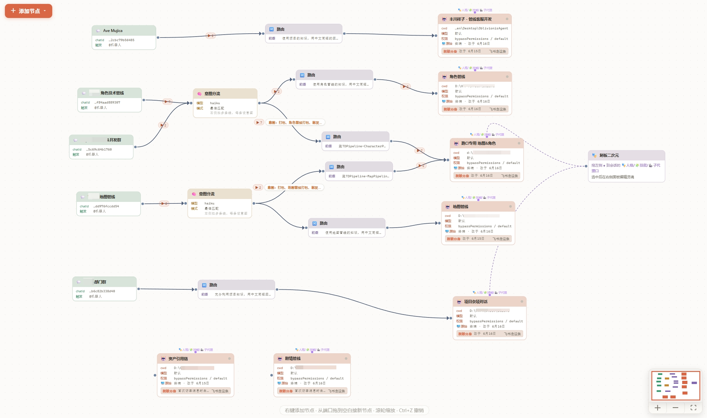 | 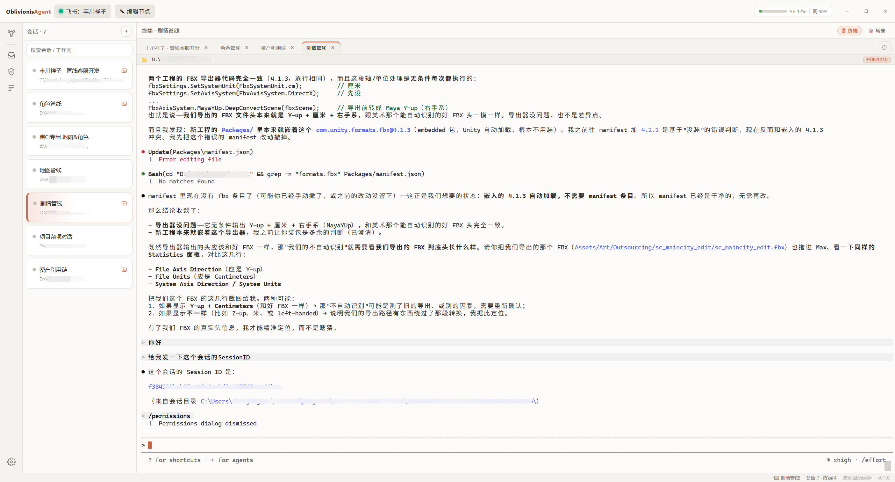 |
| Feishu group → router → session, wire nodes to connect | Multi-terminal keep-alive · paste-image input · runtime sweep |

| Intent routing | Feishu reply |
|:---:|:---:|
| 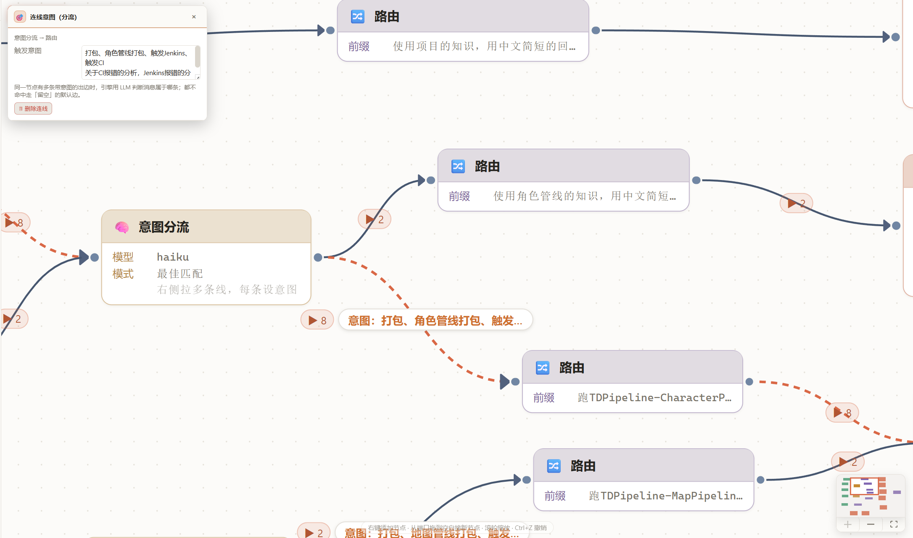 | 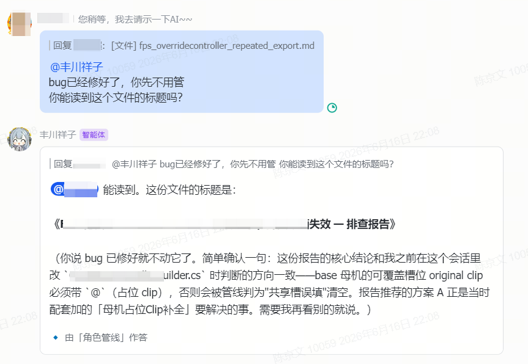 |
| Same-group messages take different branches by semantics (LLM-judged) | Rich-text reply that @-mentions the asker |

| Available node types | Claude session settings |
|:---:|:---:|
| 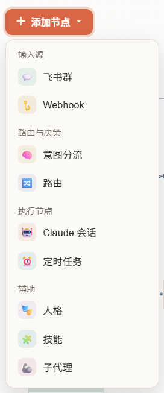 | 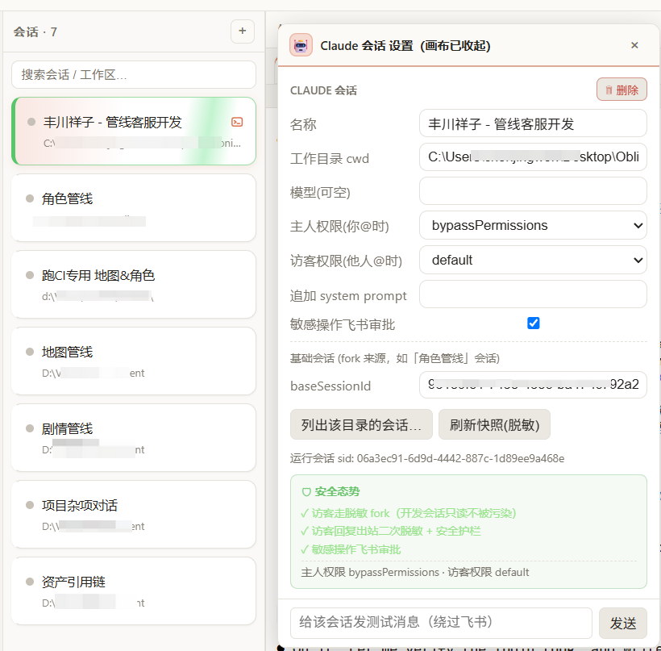 |
| Every node you can add (inputs / routing / execution / capability) | cwd · owner/guest permissions · baseSessionId · security posture |

| Audit trail | Conversation example (trigger a build + persona reply) |
|:---:|:---:|
| 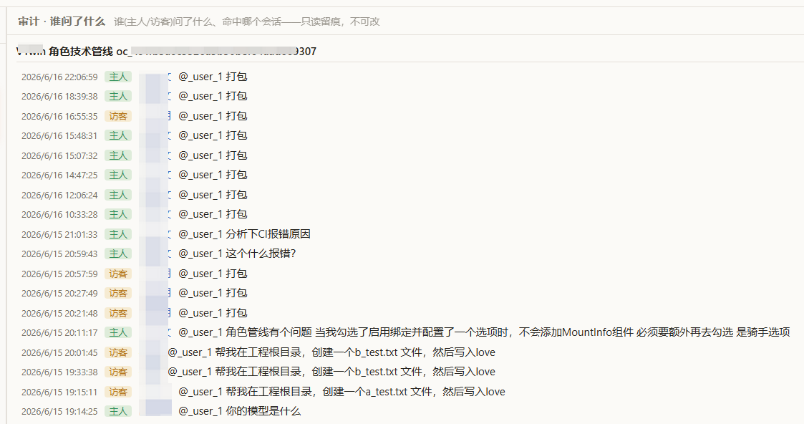 | 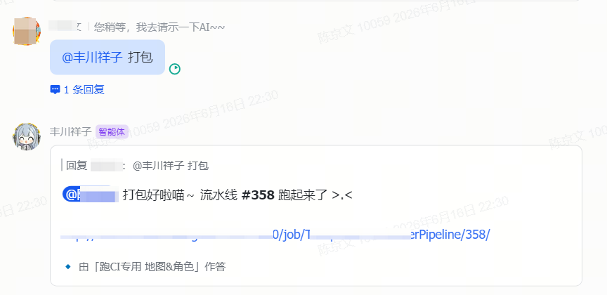 |
| Who (owner/guest) asked what, which session handled it — read-only | @bot to package → reply in the connected persona's voice, with the answering session labeled |

| 📖 Document viewer (separate window) |
|:---:|
| 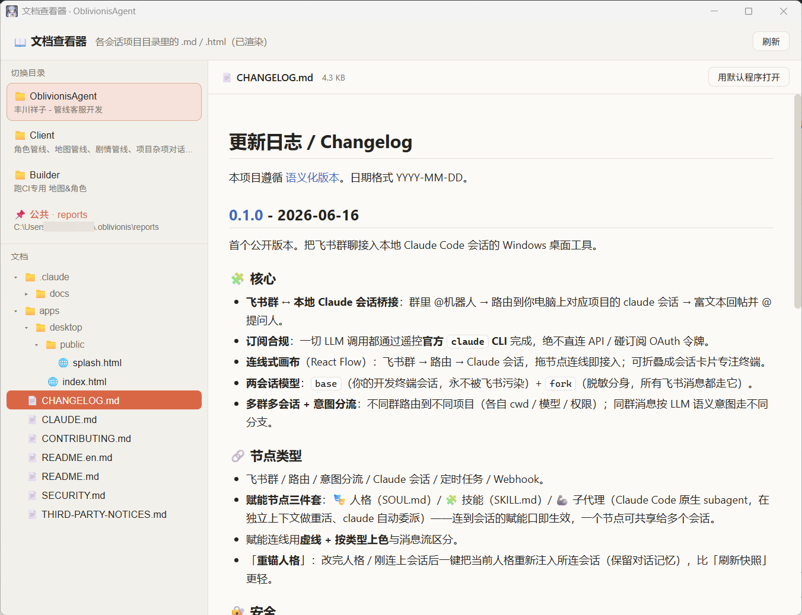 |
| `.md` / `.html` across each session's project dir as a tree, rendered on the right (the shared `reports` dir is included too) — read docs while you keep driving the main window |

---

## ✨ Highlights

| | |
|---|---|
| 🎛️ **Node-wiring canvas** | Feishu group → router → Claude session; drag and wire nodes to connect. Collapse into session cards to focus on the terminal |
| 🔀 **Multi-group, multi-session + intent routing** | Different groups route to different projects (each with its own cwd / model / permissions); same-group messages branch by semantic intent |
| 🛡️ **Owner / guest isolation** | The owner can let Claude edit code and run commands; guests go through a **redacted fork**, replies are **re-redacted** + safety guardrails — your dev context and guests' sessions never pollute each other (sensitive-op approval below) |
| 🔐 **Tool-approval card** | When a guest triggers a sensitive tool (edit file / run command) → an interactive card pops in the group; only after the owner taps **[Allow]** does it run. After a decision or a 100s timeout the card **auto-updates its state and removes the buttons**. Approval is on by default (the backstop for the guest guardrail) |
| 📊 **Self-serve commands** | `/status` (transport / model / cwd / git branch / session count) · `/doctor` self-check · `/retry` re-run the last one · `/continue` resume — owner only |
| 📄 **Rich Feishu interactions** | Read **docx / Wiki / Sheets / Bitable** for context; **read file attachments in messages** (including quoted messages — text files are inlined automatically, others are saved locally for Claude to open with Read); long replies are auto-converted to a **Feishu file** (so bubbles don't blow up); replies with Markdown tables → **native Feishu tables**; **per-tool progress** streaming card during execution (running command / reading file…) |
| 🖥️ **Built-in interactive terminal** | Double-click a node to open the dev session (full history replay); multi-terminal keep-alive · drag to reorder, paste images from the clipboard as input, **font scaling (settings slider / Ctrl±)** |
| 📖 **Document viewer** | A separate window to browse **`.md` / `.html`** under each session's project dir: organized as a **tree**, Markdown rendered (incl. raw HTML / local images), HTML shown as-is in a sandbox; the shared `reports` dir is folded in — **read docs while you keep using the main window** |
| 🎭 **Capability nodes (persona / skill / subagent)** | SOUL.md (personality) · SKILL.md (operating rules) · native Claude Code subagent (heavy work in an isolated context) are all wireable nodes; connect to a session's capability port to take effect, one node shareable across sessions; after editing, tap **"Re-anchor"** to refresh into the connected sessions (keeps memory) |
| 🌐 **Bilingual UI (中 / EN)** | One-tap switch between 中文 / English in settings; technical identifiers (sessionId / cwd, etc.) stay as-is, missing translations fall back to Chinese |
| ⏰ **Cron / Webhook / group memory / knowledge inbox** | Create cron jobs in natural language, external triggers, per-group accumulated memory, Q&A distilled into rules pending judgment |
| ✨ **Runtime animations** | Splash on startup, node-path flow lines (only the real path lights up; concurrent groups each light their own), session sweep (fork blue / terminal green / dual-run colorful), completion flag, desktop completion mascot |
| 📋 **Audit + green deployment** | Everything — who asked what in which group — is persisted; single-instance guard, clean exit on close; Tauri-packaged, runs with just two exes |

**Node types at a glance**

| 🟢 Feishu group | 🟣 Router | 🟠 Intent split | 🔵 Claude session | 🩵 Cron | 🟡 Webhook | 🎭 Persona | 🧩 Skill | 🦾 Subagent |
|:---:|:---:|:---:|:---:|:---:|:---:|:---:|:---:|:---:|
| entry · by chatId | prefix / strip @ | LLM semantic branch | lands on a local session | cron-triggered | external HTTP | SOUL.md | SKILL.md | native subagent |

> 🎭 Persona / 🧩 Skill / 🦾 Subagent are "capability nodes": drag onto a session's **persona / skill / subagent port** to affect that session's Feishu replies (persona = how it talks, skill = how it works, subagent = heavy lifting in an isolated context). One capability node can be shared across multiple sessions.

---

## 🧠 How it works

### Overall data flow

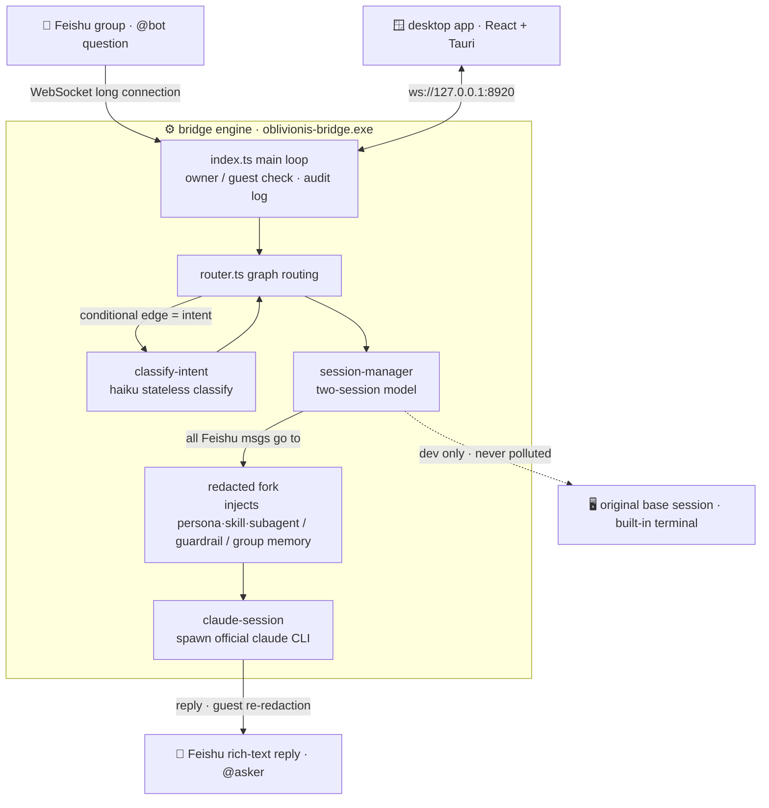

### Two-session model + persona (Soul / Fork)

Behind one "Claude session" node are **two claude sessions**; Feishu only ever touches the fork:

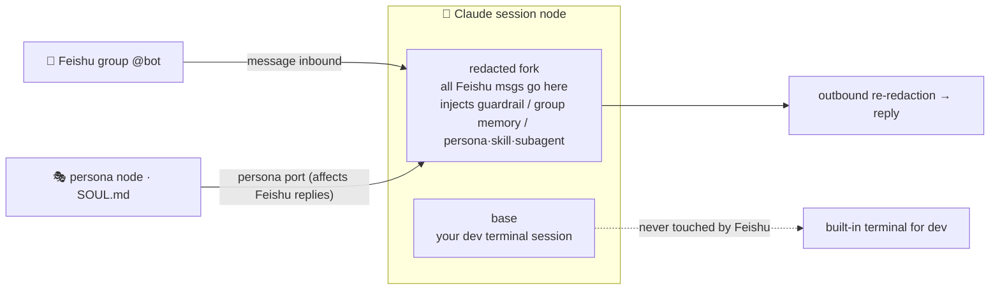

- **base**: the dev terminal session inside the app. Feishu never resumes it (to avoid polluting dev context); no persona / guardrail injected.
- **fork**: forked from base + keys scrubbed. **All Feishu messages (owner + guests) go here**; capability nodes (persona / skill / subagent), guest guardrail, and group memory are all injected into this one.

### The journey of a message

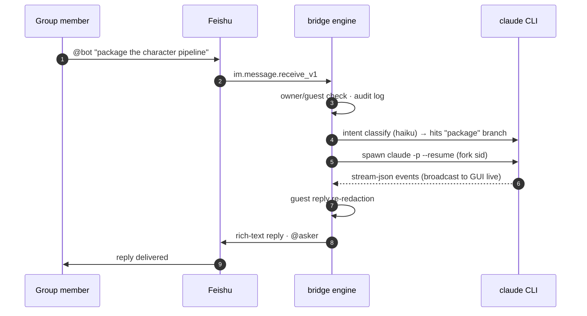

---

## 🚀 Quick start

### 1. Requirements

- Windows 10/11
- [Node.js](https://nodejs.org) ≥ 20 + pnpm (`npm i -g pnpm`)
- Rust toolchain ([rustup](https://rustup.rs), for building the desktop shell)
- A signed-in [Claude Code](https://claude.com/claude-code) CLI (`claude` on PATH)

<details>
<summary><b>📋 Feishu custom-app bot setup (click to expand)</b></summary>

- **Send/receive + resource-read permissions**: `im:message` / `im:message:send_as_bot` / `im:chat` / `im:resource`
- **Show the sender's real name**: `contact:user.base:readonly` (and set the "contact permission scope / data scope" to include the relevant members, otherwise name lookup returns 400).
  > It runs without this too — it falls back to the group member list (`im:chat`) for names, and only shows the open_id as a last resort.
- **Event subscription**: choose **long connection (WebSocket)** and subscribe to `im.message.receive_v1` (no public callback needed)
- Add the "Bot" capability and publish

</details>

### 2. Build

```bash
pnpm install
cd packages/bridge && pnpm package                    # package the engine into a sidecar exe
cd ../../apps/desktop && pnpm tauri build --no-bundle  # build the desktop app
```

The portable build is made of these (put them in the same directory):

| File | Notes |
|---|---|
| `apps/desktop/src-tauri/target/release/oblivionis-desktop.exe` | main program (rename as you like) |
| `apps/desktop/src-tauri/binaries/oblivionis-bridge-x86_64-pc-windows-msvc.exe` | engine sidecar, rename to `oblivionis-bridge.exe` |

> 💡 For day-to-day dev, the root **`rebuild-deploy.bat`** does build → deploy → restart in one click; for hot reload use `cd apps/desktop && pnpm tauri dev`.

### 3. Configure (all inside the GUI)

1. Launch the app → top bar "Feishu" → fill in App ID / App Secret → Connect (status light turns green = long connection established). The Secret is stored in the **OS credential manager**, never written as plaintext into `config.json`.
2. On the canvas, wire **Feishu group → Router → Claude session** (after the bot joins a group, send a message; a "no route for chatId" banner appears at the top, with one-click group-node creation).
3. Fill the session node's project dir `cwd` and `baseSessionId` (tap "list sessions in this dir" to pick from history) — `baseSessionId` is the dev session you open in the terminal by double-clicking the node; guest messages auto-fork a redacted clone.
4. In the "Feishu" panel, set yourself as owner (lookup openId by phone / email supported).
5. @-mention the bot in the group. Changes auto-save to `~/.oblivionis/config.json`.

---

## 🗂️ Repository layout

```
OblivionisAgent/
├─ packages/
│  ├─ shared/              # shared contract for both sides: config schema (zod), WS protocol, stream-json types
│  └─ bridge/              # engine (Node): Feishu long connection, routing, session management, fork redaction, audit
│     └─ src/
│        ├─ index.ts       #   main loop: inbound → owner/guest check → route → session → outbound redaction → reply
│        ├─ router.ts      #   graph routing + intent conditional edges
│        ├─ claude/        # ★ core that drives the claude CLI (two-session model / executor / fork redaction / intent classify)
│        ├─ secrets.ts     #   secret collection & redaction
│        ├─ secret-store.ts #  Feishu App Secret held at runtime (from credential manager, never on disk)
│        └─ transport/     #   Feishu long connection / mock
├─ apps/desktop/           # desktop app (Tauri v2 + React 18)
│  ├─ src/App.tsx          #   main UI: canvas state / config sync / terminal management
│  ├─ src/canvas/          #   React Flow canvas and node cards
│  ├─ src/i18n/            #   bilingual (Chinese source IS the key, missing translations fall back to Chinese)
│  ├─ src/panels/TerminalsHost.tsx  # ★ interactive terminal (multi-terminal keep-alive / paste image / hotkeys)
│  ├─ src-tauri/src/lib.rs # ★ Rust: PTY, paste-image to disk, open path, sidecar spawn, credential manager
│  └─ src-tauri/examples/  #   PTY debug probes (capture bytes / test key sequences)
├─ rebuild-deploy.bat      # one-click build + deploy
├─ CLAUDE.md               # Claude Code project notes (auto-loaded when you open the repo)
└─ .claude/docs/           # ★ knowledge base: architecture map / pitfalls / workflows / design research
```

**Forking for further development? Read [`.claude/docs/`](.claude/docs/) first:**

| Doc | Content |
|---|---|
| [architecture.md](.claude/docs/architecture.md) | data-flow diagrams + what each core file does (**the map**) |
| [conventions.md](.claude/docs/conventions.md) | code conventions / rules / hard security constraints (**read before coding**) |
| [extending.md](.claude/docs/extending.md) | **step-by-step recipes to add features**: node / command / panel / message / transport / i18n |
| [pitfalls.md](.claude/docs/pitfalls.md) | every pitfall paid for (session path encoding, PTY races, xterm rendering, Windows encoding…) |
| [workflows.md](.claude/docs/workflows.md) | standard flows for build / debug / smoke test / onboarding a new group |
| [research-hermes-oauth.md](.claude/docs/research-hermes-oauth.md) | design research and the subscription-compliance rationale |

> Opening this repo with Claude Code auto-loads `CLAUDE.md` for the best AI-assisted development experience.

---

## 🔐 Security model

| Measure | Where it lives |
|---|---|
| Subscription compliance: only drive the official CLI, never touch OAuth tokens | overall architecture |
| Feishu App Secret stored in the **Windows Credential Manager**, never plaintext in `config.json`, never WS-broadcast | `secret-store.ts` + `src-tauri/lib.rs` |
| Guest sessions forked from the dev session, transcript keys replaced with `[REDACTED]` | `fork-prepare.ts` |
| Guest replies re-redacted before going out | `index.ts` + `secrets.ts` |
| Guest guardrail system prompt (strictly no leaking keys / credentials / sensitive files / permissions / personal info) | `guestGuardrail` config |
| Guest sensitive ops (edit file / command) gated by the owner's **Feishu approval card**; fork-specific `ask` rule backstops the global `allow` | `perm/` + `~/.oblivionis/fork-settings.json` |
| Tiered permission mode for owner / guest | session node config |
| Full inbound audit at `~/.oblivionis/audit.jsonl` | `index.ts` |

> [!NOTE]
> The exe / installer is **not code-signed**: on first launch Windows SmartScreen will block it — click **"More info → Run anyway"**. This is the normal block for unsigned binaries and does not affect functionality or security.

---

## 📜 License

[**GNU General Public License v3.0 (GPL-3.0)**](LICENSE) — free software, strong copyleft: **anyone may freely use, modify, redistribute, and even use it commercially**; but as soon as you **distribute** it (including packaging it into an exe for others), you **must keep it open-source under GPL-3.0 and provide the complete source (including your changes)**. Turning it into a closed-source proprietary product is not allowed.

**Copyright © 2026 Derek·JW·Chen** — Licensed under GPL-3.0.

Licenses and copyright notices for the bundled third-party open-source components are in [THIRD-PARTY-NOTICES.md](THIRD-PARTY-NOTICES.md) (shipped with the release; regenerate with `node scripts/gen-notices.cjs`). It includes 5 MPL‑2.0 weak-copyleft components (Tauri's CSS-parsing chain, usable as-is when unmodified).
