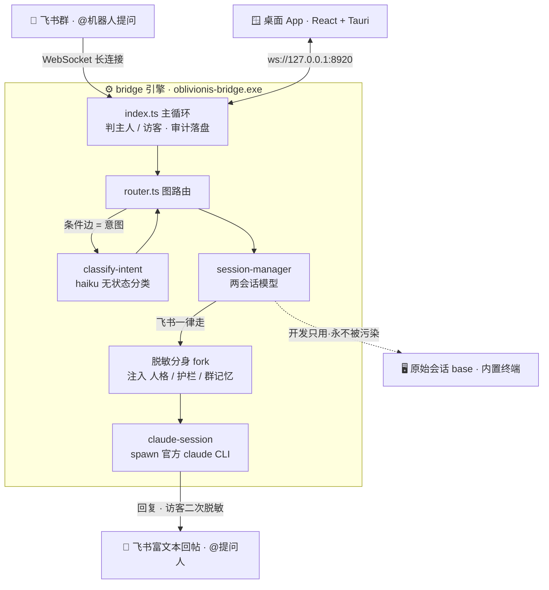
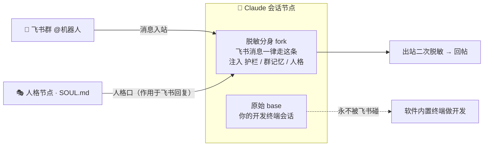
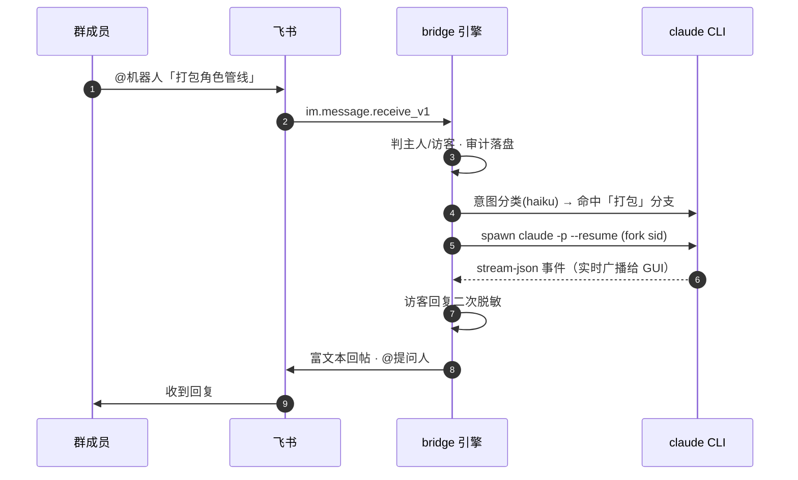

<div align="center">

# 🌒 OblivionisAgent

**把飞书群聊接入你「本地 Claude Code 会话」的 Windows 桌面工具**

在群里 @机器人 提问 → 路由到你电脑上对应项目的 Claude 会话 → 富文本回帖并 @提问人。
你继续在内置终端用同一套会话做开发，访客与你的工作互不污染。


</div>

> [!IMPORTANT]
> **为什么是「遥控本地 CLI」而不是调 API？**
> 很多人用的是 Claude 订阅（Pro/Max）而非 API Key。Anthropic 禁止第三方工具直接使用订阅 OAuth
> 令牌（2026‑01 服务端封禁、2026‑02 写入 ToS），所以本项目一切 LLM 调用都通过驱动 **官方 `claude`
> CLI** 完成——合规、零额外成本，且完整复用你已有的会话历史与项目上下文。
> 调研详情见 [`.claude/docs/research-hermes-oauth.md`](.claude/docs/research-hermes-oauth.md)。

---

## 📸 界面预览

> 截图占位——把对应 PNG 放进 [`docs/screenshots/`](docs/screenshots/) 即自动显示（命名见该目录说明）。

| 连线配置画布 | 内置交互终端 |
|:---:|:---:|
|  |  |
| 飞书群 → 路由 → 会话，拖节点连线即接入 | 多终端保活 · 贴图喂图 · 运行时扫光 |

| 意图分流 | 飞书回帖效果 |
|:---:|:---:|
|  |  |
| 同群消息按语义走不同分支（LLM 判定） | 富文本回复并 @ 提问人 |

---

## ✨ 亮点功能

| | |
|---|---|
| 🎛️ **连线式画布** | 飞书群 → 路由 → Claude 会话，拖节点连线即完成接入；可折叠成会话卡片专注终端 |
| 🔀 **多群多会话 + 意图分流** | 不同群路由到不同项目（各自 cwd/模型/权限）；同群消息按语义意图走不同分支 |
| 🛡️ **主人 / 访客隔离** | 主人可让 Claude 改代码执行命令；访客只读咨询，走 **fork 脱敏分身**，回复**二次脱敏** + 安全护栏 |
| 🖥️ **内置交互终端** | 双击节点打开开发会话（完整历史回放）；多终端保活、剪贴板贴图自动喂给 Claude 看图 |
| 🎭 **可连线人格节点** | SOUL.md 做成节点，连到会话「人格口」即作用于该会话的飞书回复，一格可连多会话 |
| ⏰ **定时 / Webhook / 群记忆 / 知识收件箱** | 自然语言建定时任务、外部触发、按群积累记忆、问答沉淀规则待裁决 |
| ✨ **运行时动效** | 节点链路流线（只点亮真实路径）、会话扫光（fork 蓝 / 终端绿 / 双跑彩）、完成小红旗 |
| 📋 **审计 + 绿色部署** | 谁在哪个群问了什么全部落盘；Tauri 打包，两个 exe 即可运行 |

**节点类型一览**

| 🟢 飞书群 | 🟣 路由 | 🟠 意图分流 | 🔵 Claude 会话 | 🩵 定时任务 | 🟡 Webhook | 🎭 人格 |
|:---:|:---:|:---:|:---:|:---:|:---:|:---:|
| 入口·按 chatId 匹配 | 加前缀/去@ | LLM 语义分支 | 落到本地会话 | cron 触发 | 外部 HTTP 触发 | 注入 SOUL.md |

---

## 🧠 它是怎么工作的

### 总体数据流



### 两会话模型 + 人格（Soul / Fork）

一个「Claude 会话」节点背后是 **两条 claude 会话**，飞书永远只碰 fork：



- **base**：软件里的开发终端会话。飞书永不续接它（避免污染开发上下文），不注入人格/护栏。
- **fork**：从 base fork + 抹密钥而来。**所有飞书消息（主人+访客）都走它**；人格、访客护栏、群记忆都注入这条。

### 一条消息的旅程



---

## 🚀 快速开始

### 1. 环境要求

- Windows 10/11
- [Node.js](https://nodejs.org) ≥ 20 + pnpm（`npm i -g pnpm`）
- Rust 工具链（[rustup](https://rustup.rs)，构建桌面壳用）
- 已登录的 [Claude Code](https://claude.com/claude-code) CLI（`claude` 在 PATH 里）

<details>
<summary><b>📋 飞书企业自建应用机器人配置（点开）</b></summary>

- **收发与读资源权限**：`im:message` / `im:message:send_as_bot` / `im:chat` / `im:resource`
- **显示发送者真实姓名**：`contact:user.base:readonly`（并把「通讯录权限范围 / 数据范围」设为包含相关成员，否则查名返回 400）。
  > 不加也能跑——会退回用群成员列表（`im:chat`）取名，再不行才显示 open_id。
- **事件订阅**：选 **长连接（WebSocket）** 并订阅 `im.message.receive_v1`（无需公网回调）
- 添加「机器人」能力并发布

</details>

### 2. 构建

```bash
pnpm install
cd packages/bridge && pnpm package                    # 引擎打包成 sidecar exe
cd ../../apps/desktop && pnpm tauri build --no-bundle  # 构建桌面应用
```

产物组成绿色版（放进同一目录）：

| 文件 | 说明 |
|---|---|
| `apps/desktop/src-tauri/target/release/oblivionis-desktop.exe` | 主程序（改名随意） |
| `apps/desktop/src-tauri/binaries/oblivionis-bridge-x86_64-pc-windows-msvc.exe` | 引擎 sidecar，改名 `oblivionis-bridge.exe` |

> 💡 日常开发用根目录 **`rebuild-deploy.bat`** 一键完成 构建 → 部署 → 重启；热重载用 `cd apps/desktop && pnpm tauri dev`。

### 3. 配置（全部在 GUI 内完成）

1. 启动应用 → 顶栏「飞书」→ 填 App ID / App Secret → 连接（状态灯转绿 = 长连接建立）
2. 画布连线 **飞书群 → 路由 → Claude 会话**（机器人入群后发条消息，顶部会弹「未路由 chatId」横幅，可一键建群节点）
3. 会话节点填项目目录 `cwd` 和 `baseSessionId`（点「列出该目录的会话」从历史里选）——`baseSessionId` 就是双击节点在终端里打开的开发会话；访客消息自动 fork 一份脱敏分身
4. 「飞书」面板把自己设为 owner（支持手机号/邮箱查 openId）
5. 群里 @机器人 即可。改动自动保存到 `~/.oblivionis/config.json`

---

## 🗂️ 仓库结构

```
OblivionisAgent/
├─ packages/
│  ├─ shared/              # 两端共享契约：配置 schema(zod)、WS 协议、stream-json 类型
│  └─ bridge/              # 引擎(Node)：飞书长连接、路由、会话管理、fork 脱敏、审计
│     └─ src/
│        ├─ index.ts       #   主循环：入站→主客判定→路由→会话→出站脱敏→回帖
│        ├─ router.ts      #   图路由 + 意图条件边
│        ├─ claude/        # ★ 驱动 claude CLI 的核心（两会话模型/执行器/fork脱敏/意图分类）
│        ├─ secrets.ts     #   密钥收集与脱敏
│        └─ transport/     #   飞书长连接 / mock
├─ apps/desktop/           # 桌面应用(Tauri v2 + React 18)
│  ├─ src/App.tsx          #   主界面：画布状态/配置同步/终端管理
│  ├─ src/canvas/          #   React Flow 画布与节点卡片
│  ├─ src/panels/TerminalsHost.tsx  # ★ 交互式终端(多终端保活/贴图/快捷键)
│  ├─ src-tauri/src/lib.rs # ★ Rust：PTY、贴图落盘、路径打开、sidecar 拉起
│  └─ src-tauri/examples/  #   PTY 调试探针(抓字节/测按键序列)
├─ rebuild-deploy.bat      # 一键构建+部署
├─ CLAUDE.md               # Claude Code 项目说明(打开仓库自动加载)
└─ .claude/docs/           # ★ 知识库：架构地图/踩坑记录/工作流/选型研究
```

**Fork 后二次开发请先读 [`.claude/docs/`](.claude/docs/)**：

| 文档 | 内容 |
|---|---|
| [architecture.md](.claude/docs/architecture.md) | 数据流图 + 每个核心文件干什么 |
| [pitfalls.md](.claude/docs/pitfalls.md) | 全部踩坑记录（会话路径编码、PTY 竞态、xterm 渲染、Windows 编码…） |
| [workflows.md](.claude/docs/workflows.md) | 构建/调试/冒烟测试/接新群的标准流程 |
| [research-hermes-oauth.md](.claude/docs/research-hermes-oauth.md) | 选型研究与订阅合规依据 |

> 用 Claude Code 打开本仓库会自动加载 `CLAUDE.md`，AI 辅助二次开发体验最佳。

---

## 🔐 安全模型

| 措施 | 实现位置 |
|---|---|
| 订阅合规：只驱动官方 CLI，不碰 OAuth 令牌 | 整体架构 |
| 访客会话 fork 自开发会话，transcript 密钥替换为 `[REDACTED]` | `fork-prepare.ts` |
| 访客回复出站前二次脱敏 | `index.ts` + `secrets.ts` |
| 访客护栏 system prompt（拒答密钥/凭据/权限/个人信息） | 配置 `guestGuardrail` |
| 主人/访客分级 permission mode | 会话节点配置 |
| 全量入站审计 `~/.oblivionis/audit.jsonl` | `index.ts` |

> [!WARNING]
> **已知待办**：`~/.oblivionis/config.json` 中 App Secret 目前**明文**存储，公司级分发前应改为 OS 凭据库；安装包未做代码签名（SmartScreen 会拦）。

---

## 📜 License

[**PolyForm Noncommercial License 1.0.0**](LICENSE) —— **仅限非商业用途**（个人 / 研究 / 教学 / 非营利可自由使用、修改、分享、二次开发；**禁止任何商业用途**）。分发时须保留署名。

**Copyright © 2026 Derek·JW·Chen**

成品捆绑的第三方开源组件的许可证与版权声明见 [THIRD-PARTY-NOTICES.md](THIRD-PARTY-NOTICES.md)（随发行物分发；`node scripts/gen-notices.cjs` 可重新生成）。其中含 5 个 MPL‑2.0 弱 copyleft 组件（Tauri 的 CSS 解析链，未改动即可使用）。
